.. VCFstat Package documentation master file, created by
   sphinx-quickstart on Tue Apr 19 13:31:09 2022.
   You can adapt this file completely to your liking, but it should at least
   contain the root `toctree` directive.

Welcome to VCFstat Package's documentation!
===========================================

===============
VCFstat Package
===============

:Author: Michael Hall
:Date:   4/19/2022

VCFstat Package in R
====================

VCFstat is an R package for Downstream analysis of VCF files.

VCFstat Package is still under development and is offered with out any
guarantee.

Build Install and Restart
=========================

.. code:: r

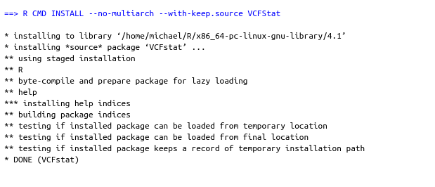

Build R CMD check results
=========================

.. code:: r

.. figure:: ../images/R_CMD_Check_Results.png

Installation
============

.. raw:: html

You can install VCFstat from github with:

**Note:** QTLseqr is a dependent package so

Examples:
=========

Load/install libraries
======================

.. code:: r 

   devtools::install_github("PBGLMichaelHall/VCFstat",force = TRUE)   
   library(VCFstat)
   library(vcfR)
   library(data.table)
   library(QTLseqr)
   library(ggplot2)

   
   # Check to see if all dependent packages are loaded.
   sessionInfo()
::

Example 1 Rice
==============

Set the Working Directory 
-------------------------

.. code:: r

   setwd("/home/michael/Desktop/QTLseqr/extdata/")
   
::
   
Define Chromomsome List object vector
~~~~~~~~~~~~~~~~~~~~~~~~~~~~~~~~~~~~~

.. code:: r

   chromlist <- c("Chr01","Chr02","Chr03","Chr04","Chr05","Chr06","Chr07","Chr08","Chr09","Chr10")
   
::

Functions
=========
   
ChromQual
---------

.. code:: r

   VCFstat::ChromQual(vcf = "freebayes_D2.filtered.vcf.gz", chromlist = chromlist,windowSize = 1e+05)

.. figure:: ../images/1.png
   :alt: 
::

ChromDP
-------

.. code:: r
   

   VCFstat::ChromDP(vcf = "freebayes_D2.filtered.vcf.gz", chromlist = chromlist,windowSize = 1e+05)

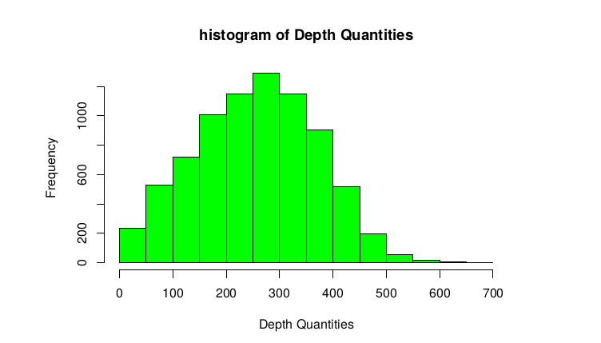
::

ChromRO
------- 

.. code:: r

   VCFstat::ChromRO(vcf = "freebayes_D2.filtered.vcf.gz", chromlist = chromlist,windowSize = 1e+05)
   
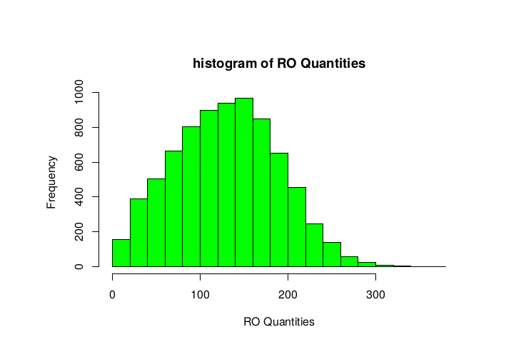
::

ChromAO
-------

.. code:: r

   VCFstat::ChromAO(vcf = "freebayes_D2.filtered.vcf.gz", chromlist = chromlist,windowSize = 1e+05)

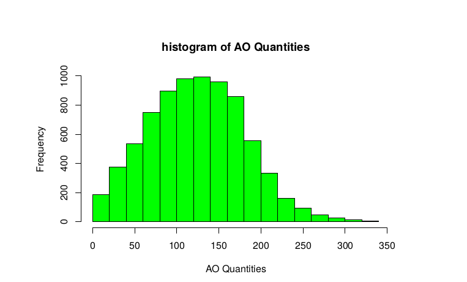
::

ChromMQM
--------

.. code:: r

   VCFstat::ChromMQM(vcf = "freebayes_D2.filtered.vcf.gz", chromlist = chromlist,windowSize = 1e+05)

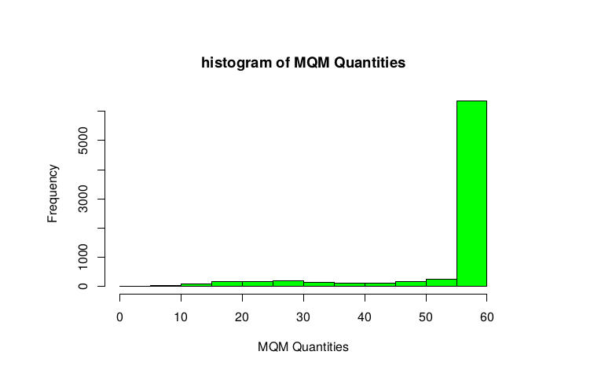
::

ChromAC
-------

.. code:: r

   VCFstat::ChromAC(vcf = "freebayes_D2.filtered.vcf.gz", chromlist = chromlist,windowSize = 1e+05)

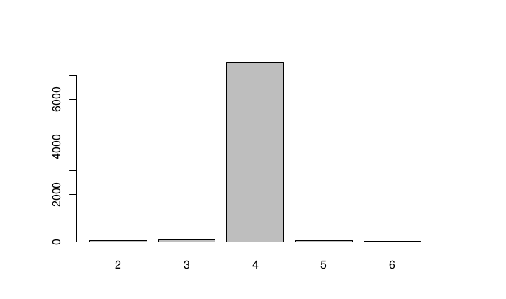
::

ChromAN
-------

.. code:: r

   VCFstat::ChromAN(vcf = "freebayes_D2.filtered.vcf.gz", chromlist = chromlist,windowSize = 1e+05)

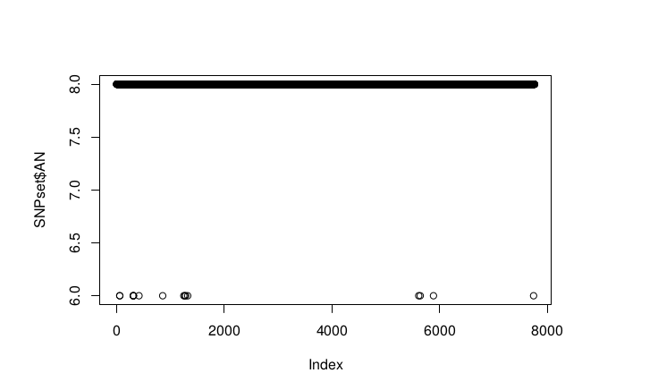
::

ChromnSNPs
----------

.. code:: r

   VCFstat::ChromnSNPs(vcf = "freebayes_D2.filtered.vcf.gz", chromlist = chromlist,windowSize = 1e+05)

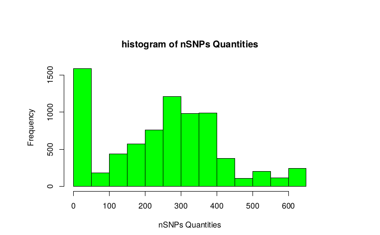
::

FacetChromnSNPs
---------------

.. code:: r

   VCFstat::FacetChromnSNPs(vcf = "freebayes_D2.filtered.vcf.gz", chromlist = chromlist,windowSize = 1e+05, ncol=10)

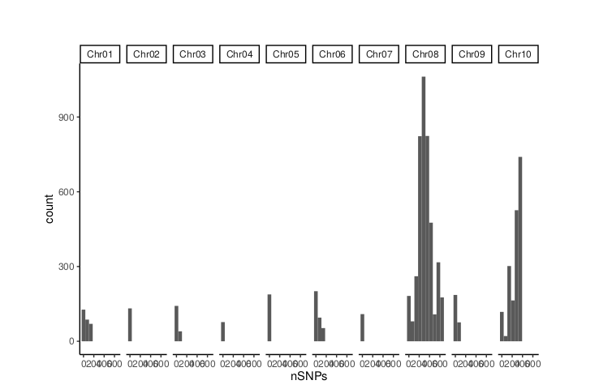
::

FacetChromQual
--------------

.. code:: r

   VCFstat::FacetChromQual(vcf = "freebayes_D2.filtered.vcf.gz", chromlist = chromlist,windowSize = 1e+05, ncol=10)

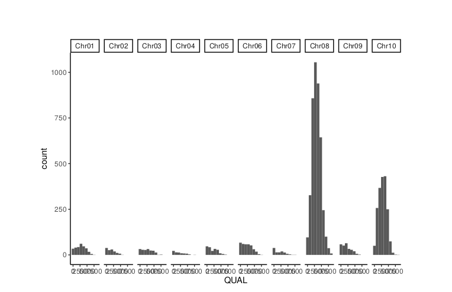
::

FacetChromDP
------------

.. code:: r

   VCFstat::FacetChromDP(vcf = "freebayes_D2.filtered.vcf.gz", chromlist = chromlist,windowSize = 1e+05, ncol=10)

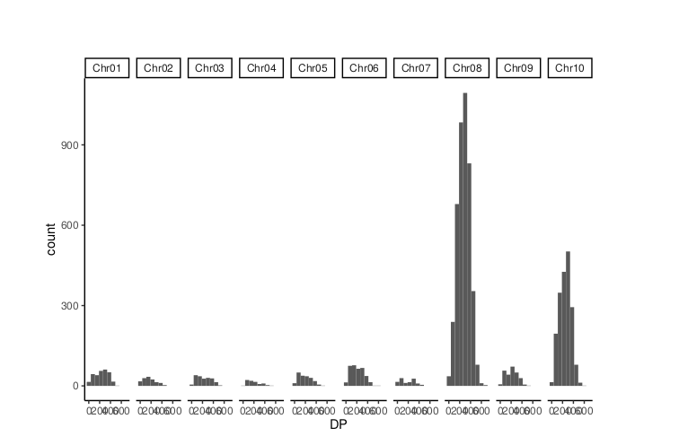
::

FacetChromAO
------------

.. code:: r
   
   VCFstat::FacetChromAO(vcf = "freebayes_D2.filtered.vcf.gz", chromlist = chromlist,windowSize = 1e+05, ncol=10)

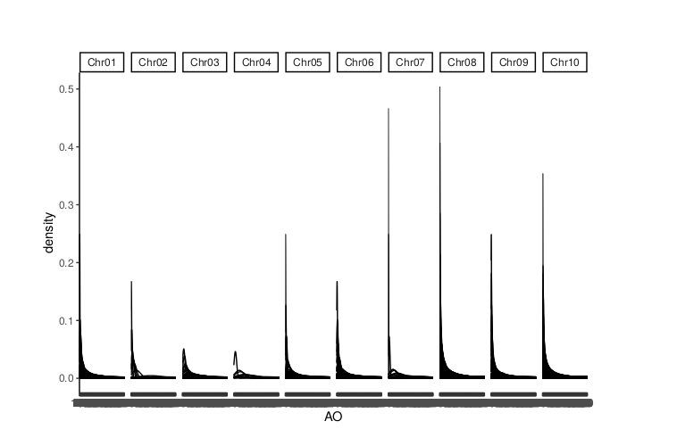

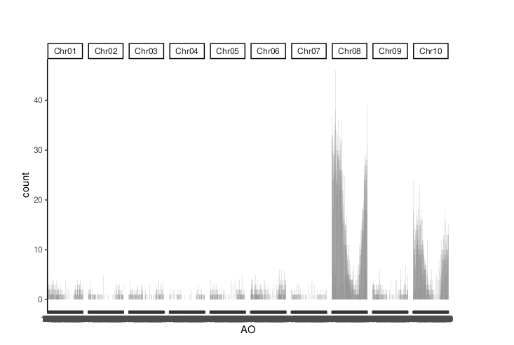
::

Example 2 Brachypodium
======================

Set Working Directory
---------------------

.. code:: r

   setwd("/home/michael/Desktop/Variants/Decompressed/")
::

Define Chromosome Vector
-----------------------

.. code:: r

   chromlist <- c("NC_016131.3","NC_016132.3","NC_016133.3","NC_016134.3","NC_016135.3")
::

Functions
=========

ChromQual
---------

.. code:: r
   VCFstat::ChromQual(vcf = "freebayes~bwa~GCF_000005505.3_Brachypodium_distachyon_v3.0~all_samples~filtered-strict.vcf", chromlist = chromlist,windowSize = 1e+05)

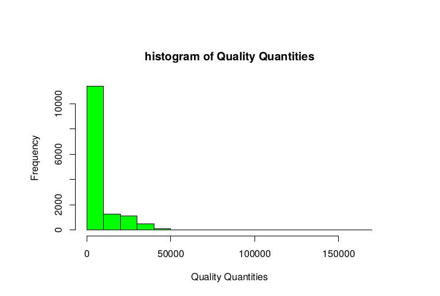
::

ChromDP
-------

.. code:: r

   VCFstat::ChromDP(vcf = "freebayes~bwa~GCF_000005505.3_Brachypodium_distachyon_v3.0~all_samples~filtered-strict.vcf", chromlist = chromlist,windowSize = 1e+05)

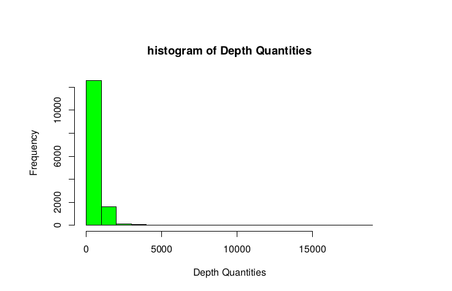
::

ChromRO
-------

.. code:: r

   VCFstat::ChromRO(vcf = "freebayes~bwa~GCF_000005505.3_Brachypodium_distachyon_v3.0~all_samples~filtered-strict.vcf", chromlist = chromlist,windowSize = 1e+05, binwidth = 10)

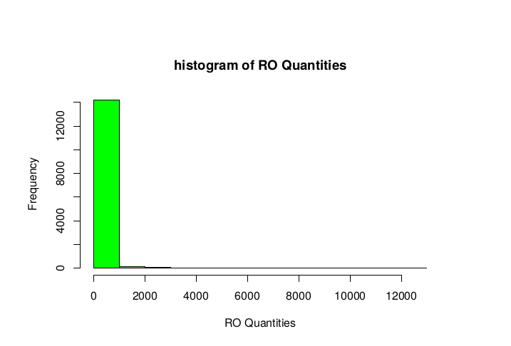
::

ChromAO
-------
  
.. code:: r

   VCFstat::ChromAO(vcf = "freebayes~bwa~GCF_000005505.3_Brachypodium_distachyon_v3.0~all_samples~filtered-strict.vcf", chromlist = chromlist,windowSize = 1e+05, binwidth = 10)

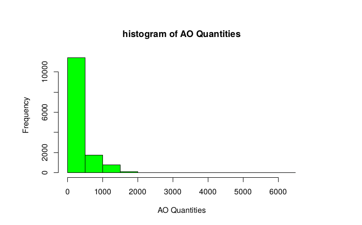
::

ChromMQM
--------

.. code:: r

   VCFstat::ChromMQM(vcf = "freebayes~bwa~GCF_000005505.3_Brachypodium_distachyon_v3.0~all_samples~filtered-strict.vcf", chromlist = chromlist,windowSize = 1e+05, binwidth = 10)

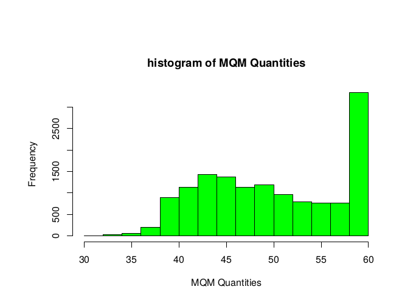
::

ChromAC
-------

.. code:: r

   VCFstat::ChromAC(vcf = "freebayes~bwa~GCF_000005505.3_Brachypodium_distachyon_v3.0~all_samples~filtered-strict.vcf", chromlist = chromlist,windowSize = 1e+05, binwidth = 10)

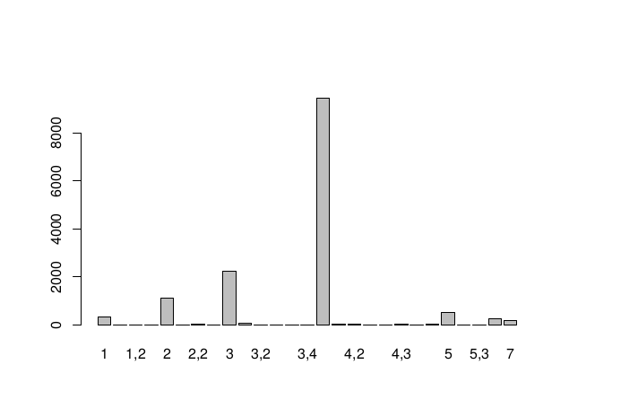
::

ChromAN
-------

.. code:: r

   VCFstat::ChromAN(vcf = "freebayes~bwa~GCF_000005505.3_Brachypodium_distachyon_v3.0~all_samples~filtered-strict.vcf", chromlist = chromlist,windowSize = 1e+05, binwidth = 10)

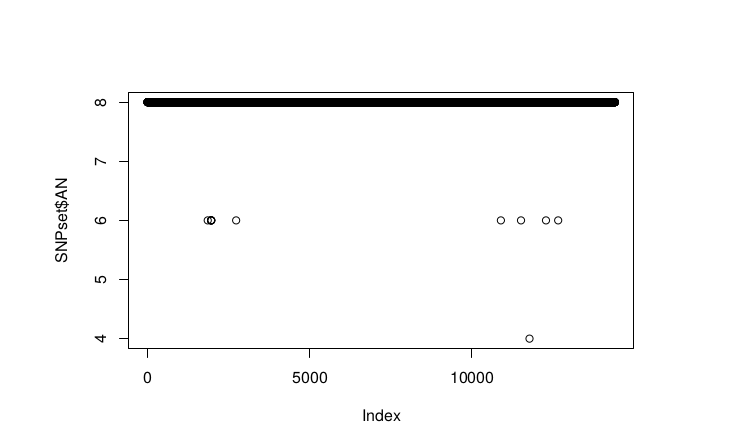
::

ChromnSNPs
----------

.. code:: r

   VCFstat::ChromnSNPs(vcf = "freebayes~bwa~GCF_000005505.3_Brachypodium_distachyon_v3.0~all_samples~filtered-strict.vcf", chromlist = chromlist,windowSize = 1e+05, binwidth = 10)

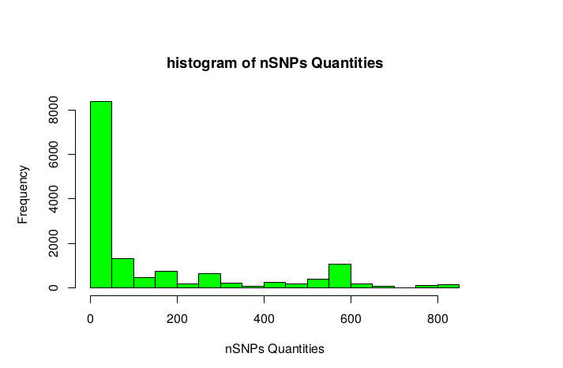
::

FacetChromnSNPs
---------------

.. code:: r

   VCFstat::FacetChromnSNPs(vcf = "freebayes~bwa~GCF_000005505.3_Brachypodium_distachyon_v3.0~all_samples~filtered-strict.vcf", chromlist = chromlist,windowSize = 1e+05, ncol=10)

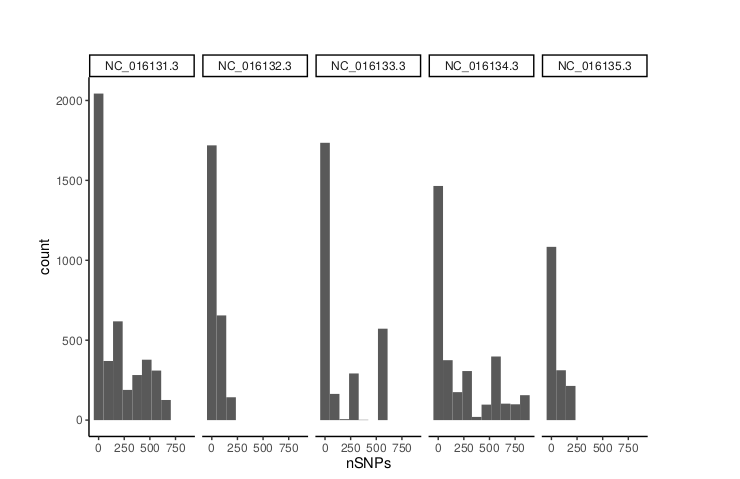
::

FacetChromQual
--------------

.. code:: r

   VCFstat::FacetChromQual(vcf = "freebayes~bwa~GCF_000005505.3_Brachypodium_distachyon_v3.0~all_samples~filtered-strict.vcf", chromlist = chromlist,windowSize = 1e+05, ncol=10)

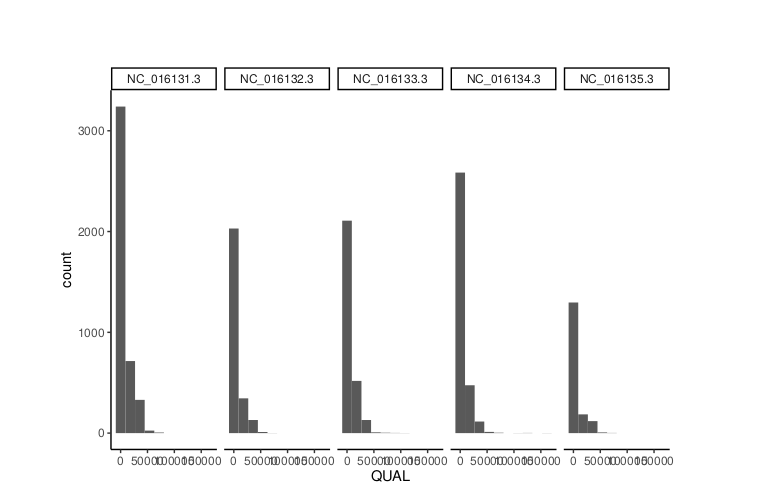
::

FaceChromDP
-----------

.. code:: r

   VCFstat::FacetChromDP(vcf = "freebayes~bwa~GCF_000005505.3_Brachypodium_distachyon_v3.0~all_samples~filtered-strict.vcf", chromlist = chromlist,windowSize = 1e+05, ncol=10)
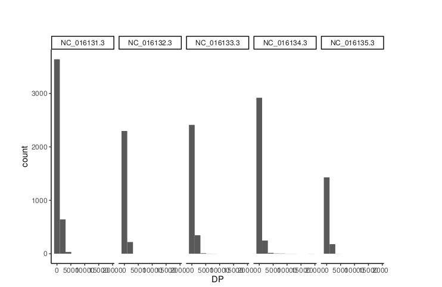
::

FacetChromAO
------------

.. code:: r

   VCFstat::FacetChromAO(vcf = "freebayes~bwa~GCF_000005505.3_Brachypodium_distachyon_v3.0~all_samples~filtered-strict.vcf", chromlist = chromlist,windowSize = 1e+05, ncol=10)

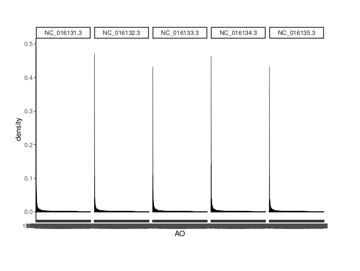

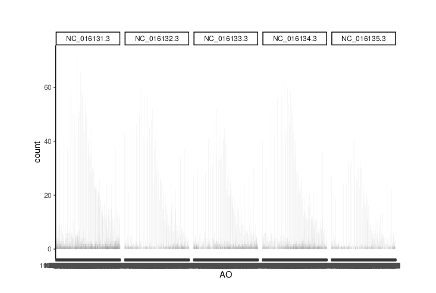
::

