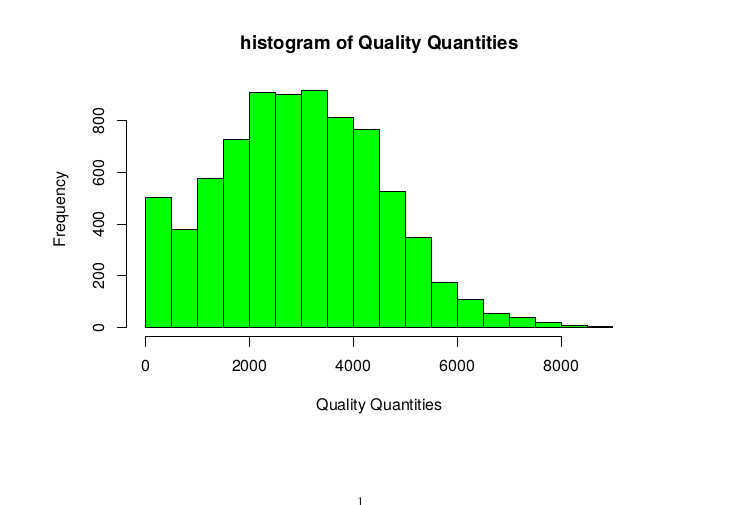

.. VCFstat Package documentation master file, created by
   sphinx-quickstart on Tue Apr 19 13:31:09 2022.
   You can adapt this file completely to your liking, but it should at least
   contain the root `toctree` directive.

Welcome to VCFstat Package's documentation!
===========================================

===============
VCFstat Package
===============

:Author: Michael Hall
:Date:   4/19/2022

VCFstat Package in R
==========

VCFstat is an R package for Downstream analysis of VCF files.

VCFstat Package is still under development and is offered with out any
guarantee.

**For more please read the docs**\ `here <https://github.com/bmansfeld/QTLseqr/raw/master/vignettes/QTLseqr.pdf>`__
---------------------------------------------------------------------------------------------------------------------------------------------

Installation
============

.. raw:: html

You can install VCFstat from github with:

**Note:** QTLseqr is a dependent package so

Examples:
=========
Load/install libraries
======================

.. code:: r 
   
   install.packages(“tinytex”) 
   install.packages(“vcfR”) 
   install.packages(“tidyr”) 
   install.packages(“ggplot2”)
   devtools::install_github(“PBGLMichaelHall/QTLseqr”,force = TRUE)
   devtools::install_github("PBGLMichaelHall/VCFstat",force = TRUE)   
   library(QTLseqr) 
   library(VCFstat)
   library(tinytex) 
   library(vcfR) 
   library(tidyr)
   library(ggplot2)

::

   # Set the Working Directory to where VCF file is stored in computer file system

.. code:: r

   setwd("/home/michael/Desktop/QTLseqr/extdata/")
   chromlist <- c("Chr01","Chr02","Chr03","Chr04","Chr05","Chr06","Chr07","Chr08","Chr09","Chr10")

   VCFstat::ChromQual(vcf = "freebayes_D2.filtered.vcf.gz", chromlist = chromlist,windowSize = 1e+05, binwidth = 50,Maximum=5000)

.. code:: r

   VCFstat::ChromDP(vcf = "freebayes_D2.filtered.vcf.gz", chromlist = chromlist,windowSize = 1e+05, binwidth = 10)

.. figure:: ../images/2.png

  

.. code:: r

   
   VCFstat::ChromRO(vcf = "freebayes_D2.filtered.vcf.gz", chromlist = chromlist,windowSize = 1e+05, binwidth = 10)
.. figure:: ../images/3.png
   :alt: 

.. code:: r

   VCFstat::ChromAO(vcf = "freebayes_D2.filtered.vcf.gz", chromlist = chromlist,windowSize = 1e+05, binwidth = 10)

.. figure:: ../images/4.png

.. code:: r

   VCFstat::ChromAO(vcf = "freebayes_D2.filtered.vcf.gz", chromlist = chromlist,windowSize = 1e+05, binwidth = 10)

.. code:: r

   VCFstat::ChromAC(vcf = "freebayes_D2.filtered.vcf.gz", chromlist = chromlist,windowSize = 1e+05, binwidth = 10)

.. code:: r

   VCFstat::ChromAN(vcf = "freebayes_D2.filtered.vcf.gz", chromlist = chromlist,windowSize = 1e+05, binwidth = 10)

.. code:: r

   VCFstat::ChromnSNPs(vcf = "freebayes_D2.filtered.vcf.gz", chromlist = chromlist,windowSize = 1e+05, binwidth = 10)

.. code:: r

   VCFstat::FacetChromnSNPs(vcf = "freebayes_D2.filtered.vcf.gz", chromlist = chromlist,windowSize = 1e+05, ncol=10)

  

.. code:: r

   VCFstat::FacetChromQual(vcf = "freebayes_D2.filtered.vcf.gz", chromlist = chromlist,windowSize = 1e+05, ncol=10)

.. code:: r

   VCFstat::FacetChromDP(vcf = "freebayes_D2.filtered.vcf.gz", chromlist = chromlist,windowSize = 1e+05, ncol=10)

.. figure:: ../images/11.png
   :alt: 

.. code:: r
   
   VCFstat::FacetChromAO(vcf = "freebayes_D2.filtered.vcf.gz", chromlist = chromlist,windowSize = 1e+05, ncol=10)

.. figure:: ../images/12.png
   :alt: 

.. figure:: ../images/13.png

.. code:: r

   setwd("/home/michael/Desktop/Variants/Decompressed/")

   chromlist <- c("NC_016131.3","NC_016132.3","NC_016133.3","NC_016134.3","NC_016135.3")

   VCFstat::ChromQual(vcf = "freebayes~bwa~GCF_000005505.3_Brachypodium_distachyon_v3.0~all_samples~filtered-strict.vcf", chromlist = chromlist,windowSize = 1e+05, binwidth = 50,Maximum=5000)

.. code:: r

   VCFstat::ChromDP(vcf = "freebayes~bwa~GCF_000005505.3_Brachypodium_distachyon_v3.0~all_samples~filtered-strict.vcf", chromlist = chromlist,windowSize = 1e+05, binwidth = 10)

.. figure:: ../images/15.png
   :alt: 

 

.. code:: r

   VCFstat::ChromRO(vcf = "freebayes~bwa~GCF_000005505.3_Brachypodium_distachyon_v3.0~all_samples~filtered-strict.vcf", chromlist = chromlist,windowSize = 1e+05, binwidth = 10)

  
.. code:: r

   VCFstat::ChromAO(vcf = "freebayes~bwa~GCF_000005505.3_Brachypodium_distachyon_v3.0~all_samples~filtered-strict.vcf", chromlist = chromlist,windowSize = 1e+05, binwidth = 10)

 .. code:: r

   VCFstat::ChromMQM(vcf = "freebayes~bwa~GCF_000005505.3_Brachypodium_distachyon_v3.0~all_samples~filtered-strict.vcf", chromlist = chromlist,windowSize = 1e+05, binwidth = 10)

   .. code:: r

   VCFstat::ChromAC(vcf = "freebayes~bwa~GCF_000005505.3_Brachypodium_distachyon_v3.0~all_samples~filtered-strict.vcf", chromlist = chromlist,windowSize = 1e+05, binwidth = 10)

.. figure:: ../images/19.png
   :alt:

.. code:: r

   VCFstat::ChromAN(vcf = "freebayes~bwa~GCF_000005505.3_Brachypodium_distachyon_v3.0~all_samples~filtered-strict.vcf", chromlist = chromlist,windowSize = 1e+05, binwidth = 10)

.. figure:: ../images/20.png
   :alt: 

.. code:: r

   VCFstat::ChromnSNPs(vcf = "freebayes~bwa~GCF_000005505.3_Brachypodium_distachyon_v3.0~all_samples~filtered-strict.vcf", chromlist = chromlist,windowSize = 1e+05, binwidth = 10)

.. figure:: ../images/21.png
   :alt: 

 

.. code:: r

   VCFstat::FacetChromnSNPs(vcf = "freebayes~bwa~GCF_000005505.3_Brachypodium_distachyon_v3.0~all_samples~filtered-strict.vcf", chromlist = chromlist,windowSize = 1e+05, ncol=10)

   
.. code:: r

   VCFstat::FacetChromQual(vcf = "freebayes~bwa~GCF_000005505.3_Brachypodium_distachyon_v3.0~all_samples~filtered-strict.vcf", chromlist = chromlist,windowSize = 1e+05, ncol=10)

.. figure:: ../images/23.png
   :alt: 

.. code:: r

   VCFstat::FacetChromDP(vcf = "freebayes~bwa~GCF_000005505.3_Brachypodium_distachyon_v3.0~all_samples~filtered-strict.vcf", chromlist = chromlist,windowSize = 1e+05, ncol=10)

.. code:: r

   VCFstat::FacetChromAO(vcf = "freebayes~bwa~GCF_000005505.3_Brachypodium_distachyon_v3.0~all_samples~filtered-strict.vcf", chromlist = chromlist,windowSize = 1e+05, ncol=10)

